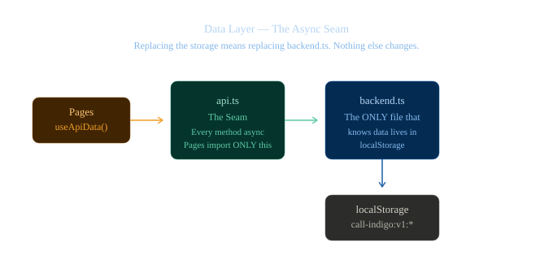

# Data layer

**Kind:** dated · **Owner:** `src/lib/data/` · **Last verified:** 2026-09-27 at `2f009a2`

The full surface. The *reasoning* is in
[`../40-project/decisions/0003-localstorage-behind-an-async-seam.md`](../40-project/decisions/0003-localstorage-behind-an-async-seam.md);
the *shape* is in [`../20-development/architecture.md`](../20-development/architecture.md#seam-2--the-data-layer).
This document is the lookup table.

---

## 1. The chain



*Figure 1 — The async seam: pages call `api.ts`, which calls `backend.ts`, which reads from `localStorage`. Replacing the storage means replacing one file.*

```
pages  →  api.ts  →  backend.ts  →  localStorage
            ↑
   the only seam; async on purpose
```

| File | Lines | Owns |
|---|---:|---|
| `types.ts` | 164 | The domain types, storage-agnostic |
| `seed.ts` | 199 | First-run fixtures |
| `backend.ts` | 136 | **The only file that knows where data physically lives** |
| `api.ts` | 180 | **The seam.** Every method `async` |
| `hooks.ts` | 62 | `useApiData` — the single read path |
| `use-draft.ts` | 57 | Draft state that survives a background refresh |

[M: `wc -l src/lib/data/*.ts` — 798 lines total. `src/admin/auth.ts` is 317.]

## 2. The storage namespace

```
call-indigo:v1:<key>
```

**Versioned on purpose.** A shape change bumps `v1` rather than migrating, and a stale
key is inert rather than corrupting.

**One key is deliberately outside the namespace:** the auth session
([`../40-project/decisions/0002`](../40-project/decisions/0002-client-side-admin-gate.md)).
It lives in `sessionStorage` under its own key, so **"Reset demo data" does not sign the
operator out.** That is a decision, not an oversight — and it is the kind of thing that
looks like a bug until you know.

## 3. The API surface

Every method returns a promise. **`api.ts` is the only module a page may import.**

### Inquiries

| Method | Returns | Notes |
|---|---|---|
| `listInquiries()` | `Inquiry[]` | **Newest first** — the inbox's default order, sorted by `createdAt` |
| `getInquiry(id)` | `Inquiry \| null` | |
| `createInquiry(input)` | `Inquiry` | **Called by the public inquiry form.** Sets `status: "new"`, stamps `createdAt`/`updatedAt`, `notes: ""` |
| `updateInquiry(id, patch)` | `Inquiry` | **Throws** `No inquiry with id <id>` if the id is unknown. Stamps `updatedAt` |
| `deleteInquiry(id)` | `void` | |

### Settings, profile, notifications, security

| Method | Returns |
|---|---|
| `getSettings()` / `saveSettings(v)` | `SiteSettings` |
| `getProfile()` / `saveProfile(v)` | `AdminProfile` |
| `getNotifications()` / `saveNotifications(v)` | `NotificationPrefs` |
| `getSecurity()` / `saveSecurity(v)` | `SecurityState` |

### Housekeeping

| Method | Does |
|---|---|
| `resetDemoData()` | **Clears every key and restores the seed fixtures.** Does not touch the session |

### Subscription

| Export | Purpose |
|---|---|
| `getVersion()` | The change counter. A **stable primitive**, for `useSyncExternalStore` |
| `subscribeToChanges(fn)` | Registers a listener; returns an unsubscribe function |

## 4. Why a version counter

Mutations call `bump()`, which increments `version` and notifies the `Set` of listeners.
`useApiData` subscribes via `useSyncExternalStore`.

**This is the whole cross-page reactivity mechanism.** Submitting the form on `/contact`
repaints the dashboard inbox without either page knowing the other exists — one integer
and a listener `Set`. No context, no prop drilling, no global store.

`useApiData(key, load)` takes an explicit **`key`** rather than a dependency array.
Deliberate: a dependency array built from inline values defeats the lint rule that would
otherwise catch a missing dependency.

## 5. The seed

**9 inquiries** covering:
- every status,
- both property types,
- all three urgency levels.

Restored by **Settings → Security → Reset demo data**.

## 6. Latency, and why it is there

```js
const LATENCY_MS = 140
```

Small enough not to be annoying, large enough that **loading and in-flight button states
are actually exercised during review.** A UI that only ever renders its loaded state is a
UI whose loading state is untested.

> ⚠️ **The consequence for verification:** every `useApiData` page renders as
> **skeletons** in the headless suite, because the effect that would resolve the promise
> never runs. **No data-driven admin UI is checkable from `npm test`.** See
> [`../20-development/testing.md` §4.3](../20-development/testing.md#43-every-data-driven-admin-page).

## 7. Failure modes

| Failure | Behaviour | Why |
|---|---|---|
| **Corrupt JSON** in a key | Falls back rather than throwing | A demo must not be taken down by its own storage |
| **Quota exceeded** | Falls back rather than throwing | Same |
| **`sessionStorage` unavailable** (private-mode Safari, storage disabled) | `auth.ts` probes for it and falls back | Same |
| **`crypto.randomUUID` absent** | Falls back to a timestamp + random id | Older browsers |
| **A write fails** | **It can fail silently.** This is the cost of the two fallbacks above | ⚠️ The deliberate trade: resilience over loudness |

## 8. The limitations, stated plainly

1. **`localStorage` is not a database.** Data is per-browser, is not shared between users
   or devices, and is cleared with site data.
2. **The contact form tells the business nothing.** `/contact` writes to the
   **submitter's own** `localStorage`. A demo where the client fills in the form and
   checks their inbox will find nothing. **Say this out loud before a demo.**
3. **No migration is possible.** A real backend starts empty. Acceptable now because
   there is nothing worth migrating — and it will not be true after the first real
   inquiry.
4. **No authentication on the data.** Anything in the namespace is readable by anything
   that can run script on the origin.

**Replacing `localStorage` with `fetch` is a change to `api.ts` alone** — that is what
the seam is for, and it is PRD §16.2 **F2**.

---

**Last verified:** 2026-09-27 at `2f009a2`
